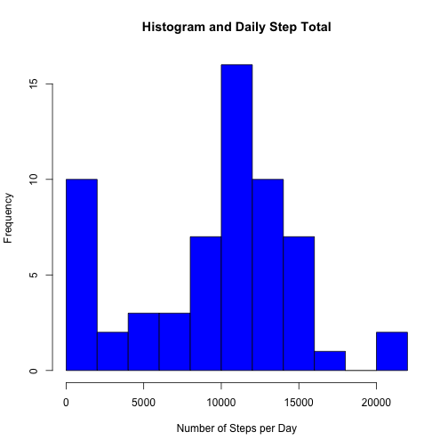
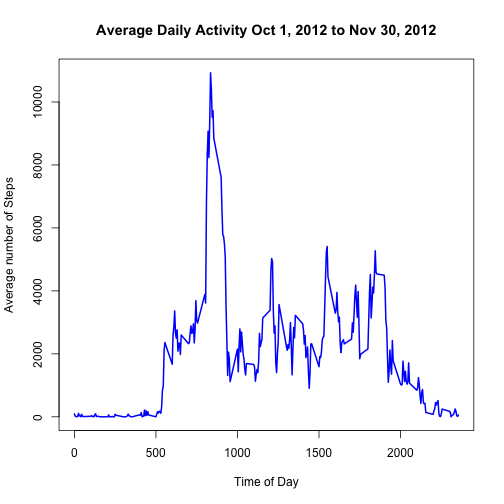
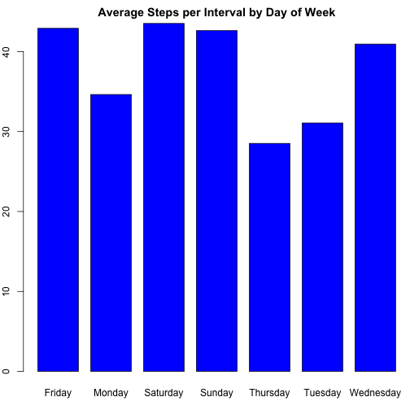
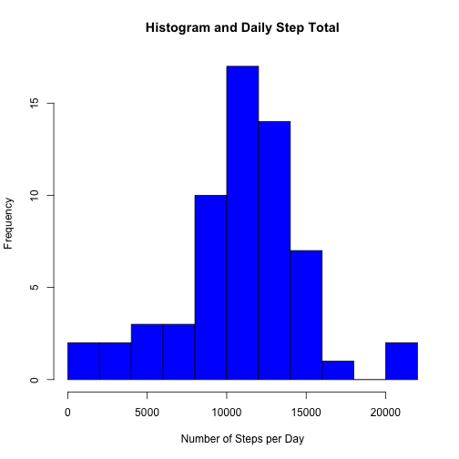
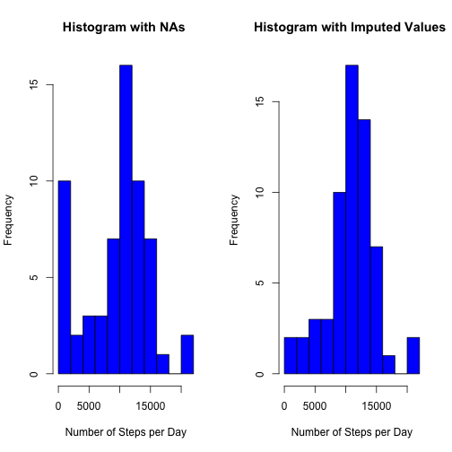
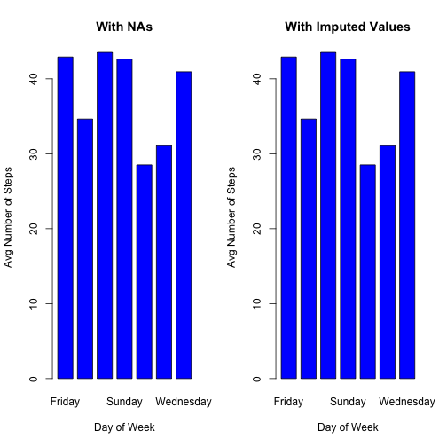
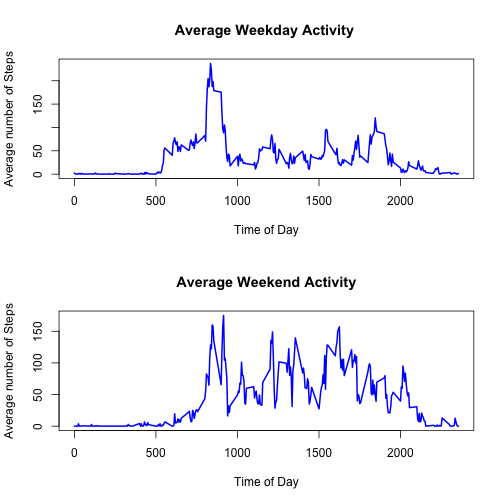

#First Assignment Reproducable Research Course

This is my first attempt at using R Markdown and knitr.  It is part of the first class assignment for the Coursera Course on Reproducable Research, course #5 in the Johns Hopkins series on using R in Data Science. 

#Loading and Pre-processing the Data

The first step is to read in the raw data file, activity.csv, and to perform an initial evaluation.  The data was initially downloaded from my Github account after being forked from https://github.com/rdpeng/RepData_PeerAssessment1.  I created my Github repository on **March 4, 2016 at 5:00PM**.

The call to Sys.time below will indicate what time the file was read into R, but unless I update the date above, it will always be the csv file I copied down on 3/4/16.


```r
#Load necessary libraries
library(dplyr)
library(knitr)

#Set the working directory correctly
setwd("~/Desktop/RProjects/Coursera/ReproducableResearch/Assignment1/ReproducableDataAssignment1")
list.files()
```

```
## [1] "activity.csv"      "PA1_template.html" "PA1_template.Rmd" 
## [4] "README.md"
```

```r
#Note the date and time that the data has been read
Sys.time()
```

```
## [1] "2016-03-05 23:46:50 EST"
```

```r
#Read in the data
activity <- read.csv('activity.csv')

#Add the weekday column to the activity data set
activity <- mutate(activity, day = weekdays(as.Date(as.character(date))))

#examine the activity dataframe
str(activity)
```

```
## 'data.frame':	17568 obs. of  4 variables:
##  $ steps   : int  NA NA NA NA NA NA NA NA NA NA ...
##  $ date    : Factor w/ 61 levels "2012-10-01","2012-10-02",..: 1 1 1 1 1 1 1 1 1 1 ...
##  $ interval: int  0 5 10 15 20 25 30 35 40 45 ...
##  $ day     : chr  "Monday" "Monday" "Monday" "Monday" ...
```

```r
summary(activity)
```

```
##      steps                date          interval          day           
##  Min.   :  0.00   2012-10-01:  288   Min.   :   0.0   Length:17568      
##  1st Qu.:  0.00   2012-10-02:  288   1st Qu.: 588.8   Class :character  
##  Median :  0.00   2012-10-03:  288   Median :1177.5   Mode  :character  
##  Mean   : 37.38   2012-10-04:  288   Mean   :1177.5                     
##  3rd Qu.: 12.00   2012-10-05:  288   3rd Qu.:1766.2                     
##  Max.   :806.00   2012-10-06:  288   Max.   :2355.0                     
##  NA's   :2304     (Other)   :15840
```

```r
head(activity)
```

```
##   steps       date interval    day
## 1    NA 2012-10-01        0 Monday
## 2    NA 2012-10-01        5 Monday
## 3    NA 2012-10-01       10 Monday
## 4    NA 2012-10-01       15 Monday
## 5    NA 2012-10-01       20 Monday
## 6    NA 2012-10-01       25 Monday
```

# Structure of the *activity* Dataframe

The frame has 3 variables: steps, date, and interval.  There are 17,568 observations.  The first variable is an integer corresponding to the number of steps, the second is the date, which is listed as a factor variable, and the third is the interval, which is stored as an integer.

The number of steps for each interval varies from a minimum of 0 to a maximum of 806.  There are 2304 missing values, or roughly 13% of the total data set.

The dates run from October 1, 2012 until November 30, 2012.  There are 61 days covered in this period. Eight of them have no data. 

Each date has 288 intervals.  While the interval is expressed as an integer, it is really an expression of hours and minutes.  In otherwords, each day is divided in to 5 minute intervals.  There are 288 5-minute intervals in each 24 hour period. An integer value of 155 corresponds to 1 hour and 55 minutes. 

## Create a Histogram of the Total Number of Steps per Day

First summarize the raw data in activiy by grouping according to the data and calculating the sum of the steps for each day, then plot as a histogram.  Also calculatte and report the mean and median for each date.


```r
# group and summarize the activity data by day
dailytotals <- activity %>% group_by(date) %>%
        summarize (stepsperday = sum(steps, na.rm=TRUE),
                   meanperday = mean(steps, na.rm=TRUE),
                   meadianperday = median(steps, na.rm=TRUE) )

# Histogram with 10 bins
hist(dailytotals$stepsperday, breaks = 10,
     main= 'Histogram and Daily Step Total',
     xlab= 'Number of Steps per Day', col ='blue')
```



There are some days with no data during the entire day. For example on October 1 all interval values are NA.  As a result, these days list the mean as NaN, and the median as NA.  

For all of the days, there are large parts of the day with no activty.  As a result, over half the intervals for each day have a step value of zero.  As a result, the median is always zero, which does not tell us much.


```r
kable(dailytotals, 'markdown', row.names=NA, col.names = c('Date', '# Steps', 'Mean', 'Median'), width=40)
```


|Date       | # Steps|       Mean| Median|
|:----------|-------:|----------:|------:|
|2012-10-01 |       0|        NaN|     NA|
|2012-10-02 |     126|  0.4375000|      0|
|2012-10-03 |   11352| 39.4166667|      0|
|2012-10-04 |   12116| 42.0694444|      0|
|2012-10-05 |   13294| 46.1597222|      0|
|2012-10-06 |   15420| 53.5416667|      0|
|2012-10-07 |   11015| 38.2465278|      0|
|2012-10-08 |       0|        NaN|     NA|
|2012-10-09 |   12811| 44.4826389|      0|
|2012-10-10 |    9900| 34.3750000|      0|
|2012-10-11 |   10304| 35.7777778|      0|
|2012-10-12 |   17382| 60.3541667|      0|
|2012-10-13 |   12426| 43.1458333|      0|
|2012-10-14 |   15098| 52.4236111|      0|
|2012-10-15 |   10139| 35.2048611|      0|
|2012-10-16 |   15084| 52.3750000|      0|
|2012-10-17 |   13452| 46.7083333|      0|
|2012-10-18 |   10056| 34.9166667|      0|
|2012-10-19 |   11829| 41.0729167|      0|
|2012-10-20 |   10395| 36.0937500|      0|
|2012-10-21 |    8821| 30.6284722|      0|
|2012-10-22 |   13460| 46.7361111|      0|
|2012-10-23 |    8918| 30.9652778|      0|
|2012-10-24 |    8355| 29.0104167|      0|
|2012-10-25 |    2492|  8.6527778|      0|
|2012-10-26 |    6778| 23.5347222|      0|
|2012-10-27 |   10119| 35.1354167|      0|
|2012-10-28 |   11458| 39.7847222|      0|
|2012-10-29 |    5018| 17.4236111|      0|
|2012-10-30 |    9819| 34.0937500|      0|
|2012-10-31 |   15414| 53.5208333|      0|
|2012-11-01 |       0|        NaN|     NA|
|2012-11-02 |   10600| 36.8055556|      0|
|2012-11-03 |   10571| 36.7048611|      0|
|2012-11-04 |       0|        NaN|     NA|
|2012-11-05 |   10439| 36.2465278|      0|
|2012-11-06 |    8334| 28.9375000|      0|
|2012-11-07 |   12883| 44.7326389|      0|
|2012-11-08 |    3219| 11.1770833|      0|
|2012-11-09 |       0|        NaN|     NA|
|2012-11-10 |       0|        NaN|     NA|
|2012-11-11 |   12608| 43.7777778|      0|
|2012-11-12 |   10765| 37.3784722|      0|
|2012-11-13 |    7336| 25.4722222|      0|
|2012-11-14 |       0|        NaN|     NA|
|2012-11-15 |      41|  0.1423611|      0|
|2012-11-16 |    5441| 18.8923611|      0|
|2012-11-17 |   14339| 49.7881944|      0|
|2012-11-18 |   15110| 52.4652778|      0|
|2012-11-19 |    8841| 30.6979167|      0|
|2012-11-20 |    4472| 15.5277778|      0|
|2012-11-21 |   12787| 44.3993056|      0|
|2012-11-22 |   20427| 70.9270833|      0|
|2012-11-23 |   21194| 73.5902778|      0|
|2012-11-24 |   14478| 50.2708333|      0|
|2012-11-25 |   11834| 41.0902778|      0|
|2012-11-26 |   11162| 38.7569444|      0|
|2012-11-27 |   13646| 47.3819444|      0|
|2012-11-28 |   10183| 35.3576389|      0|
|2012-11-29 |    7047| 24.4687500|      0|
|2012-11-30 |       0|        NaN|     NA|

# Average Daily Activity Pattern

The next way to look at the data is to look at the average activty for each interval across all 61 days where we have data.  The following code produces a line plot showing this


```r
# group and summarize the activity data by interval
intervaltotals <- activity %>% group_by(interval) %>%
        summarize (steps = sum(steps, na.rm=TRUE),
                   meanval = mean(steps, na.rm=TRUE),
                   medianval = median(steps, na.rm=TRUE))

with( intervaltotals, plot(interval, meanval, type='l',
                           main = 'Average Daily Activity Oct 1, 2012 to Nov 30, 2012',
                           ylab = 'Average number of Steps',
                           xlab = 'Time of Day',
                           col='blue', lwd=2))
```



As can be seen in this graph, the peak of activity is in the early morning, between 08:00 and 10:00.  Looking at the table (intervals where average steps > 8,000) below it is clear that the peak interval across this time period occurs between 8:30 and 8:35. 

There is a great deal of variation in activity base on the time of day - much more so than there are between days of the week.


```r
ht <- filter(intervaltotals, meanval > 8000)

kable(ht, 'markdown', row.names=NA, col.names = c('Date', '# Steps', 'Mean', 'Median'), width=40)
```


| Date| # Steps|  Mean| Median|
|----:|-------:|-----:|------:|
|  815|    8349|  8349|   8349|
|  820|    9071|  9071|   9071|
|  825|    8236|  8236|   8236|
|  830|    9397|  9397|   9397|
|  835|   10927| 10927|  10927|
|  840|   10384| 10384|  10384|
|  845|    9517|  9517|   9517|
|  850|    9720|  9720|   9720|
|  855|    8852|  8852|   8852|

# Missing Values - Strategy

The next part of the assignment is filling in the missing values.  As noted above, there are 2,304 missing values out of 17,568 observations.  These values are not evenly spread.

By looking at the table of daily steps above, it is clear that there are 8 days without any values whatsoever,  That is, all 288 intervals for those  8 days are missing.  This accounts for all 2,304 missing values.

In other words, there is no day out of the 61 which contains missing values for just a couple of the intervals.  Either the entire day is missing, or the entire day has values.  Out of the 61 days, only 8 (or 13% again) have no data.  53 are complete.

The dates with missing data are:

* October 1 - Monday
* October 8 - Monday
* November 1 - Thursday
* November 4 - Sunday
* November 9 - Friday
* November 10 -Saturday
* November 14 - Wednesday
* November 30 - Friday

The time period from October 1 to November 30 includes the following number of days

* Monday - 9 - less two with missing data --> 7
* Tuesday - 9 - none missing --> 9
* Wednesday - 9 - less one with missing data --> 8
* Thursday - 9 - less one with missing data --> 8
* Friday - 9 - less two with missing data --> 7
* Saturday - 8 - less one with missing data --> 7
* Sunday - 8 - less one with missing data --> 7

So the question is:  What would be the effect of just leaving out the missing days?  The number of days for each day of the week is pretty close, with only one extra day for Wednesday and Thursday, and two for Tuesday.  Even if the missing data was not missing, there would still be two days of the week (Saturday and Sunday off by one day because the data set of 61 days is not a multiple of a week) that would be short by one.

### Is there a noticeable difference by day of the week?

The graph below shows the average number of steps by the day of the week


```r
weekdaytotals <- activity %>%
        mutate(dayofweek = weekdays(as.Date(as.character(activity$date)))) %>%
        group_by(dayofweek) %>%
        summarize (stepsperday = sum(steps, na.rm=TRUE),
                   meanstepsperday = mean(steps, na.rm=TRUE))

weekdaytotals <- arrange(weekdaytotals, dayofweek)

par(mar=c(3,2,2,0))
with( weekdaytotals, barplot(meanstepsperday,names.arg=dayofweek, 
                             main = 'Average Steps per Interval by Day of Week',
                             ylab = 'Average Number of Steps',
                             xlab = 'Day of Week',
                             col = 'blue', space=0.3))
```



As can be seen, there **is** a difference based on day of the week.  The following days average 40-plus steps per interval:

* Friday
* Saturday
* Sunday
* Wednesday

They following days average less steps per interval -  between 28 and 32, approximately.

* Monday (7 days worth of data - 2 days missing data)
* Thursday (8 days worth of data - 1 day missing data)
* Tuesday (9 days worht of data - no missing data)

### Possible approaches to missing data

It seems to me there are several approaches to dealing with the missing data.

1. Elimintate it from the data set.  There will still be 7 to 9 complete days worth of data for each day of the week. Ignoring the missing data would not seem to have any material impacts on the averages or the daily usage patterns.
2. Substitue the overall average number of steps for the missing intervals on the missing days.  This is probably not a goos approach.  As noted above, there is a significant difference in the average depending on the day of the week.  It would tend to increase the average for Monday and Thursday above that for Tuesday (which has no missing data) due to the fact that the average for Friday, Saturday, Sunday, and Wednesday is noticeably higher.
3. Substitue the average number for the specific interval on the specific day of the week.  This would be more correct, but doesn't appear to have any advantage.  It also does not correct for the fact that there will still be a differnet number of days due to the fact that the interval for the data set does ot start and stop on the same day of the week.
4. Another approach would be to substitue the daily average for each missing value.  This is **not** a good ides.  The greatest variation in activity is at different times of the day.  There is zero activty at 3:00 AM, but there is a lot of activity at 8:30 AM.  If we substitute the daily average for each interval, it would not have much affect on the daily measuremtns, but would radically change the activity by the tim eof day.  The imputed average must definitely be by interval.


### Method 3.  Impute the missing value with the mean value for that particular interval for that particular day of the week

This is a lot of work, but I think it is the most accurate way to do this,

```r
library(dplyr)

# substitue the interval average for that day of the week for each missing value
# We'll need to do this for 8 days at 288 intervals per day (2,304 total NA's)

# Start with Mondays (October 1 and Oct 8)
# Get the interval averages for the day in question
imeans <- filter(activity, day=='Monday')
imeans <- imeans %>% group_by(interval) %>%
        summarize(meansteps = mean(steps, na.rm=TRUE))
#Now Oct 1
dMissing <- filter(activity, as.character(date)=='2012-10-01')
#merge with the avarge by interva for that day
dMissing <- merge(dMissing, imeans)
#drop the NA colum and rename the average column
dMissing <- select(dMissing, -(steps))
dMissing <- rename( dMissing, steps = meansteps)
dMissing <- dMissing[c('steps', 'date', 'interval', 'day')]
imputed <- dMissing
#Now October 8
dMissing <- filter(activity, as.character(date)=='2012-10-08')
#merge with the avarge by interva for that day
dMissing <- merge(dMissing, imeans)
#drop the NA colum and rename the average column
dMissing <- select(dMissing, -(steps))
dMissing <- rename( dMissing, steps = meansteps)
dMissing <- dMissing[c('steps', 'date', 'interval', 'day')]
imputed <- rbind(imputed, dMissing)

# Now Thursday November 1
imeans <- filter(activity, day=='Thursday')
imeans <- imeans %>% group_by(interval) %>%
        summarize(meansteps = mean(steps, na.rm=TRUE))
# November 1
dMissing <- filter(activity, as.character(date)=='2012-11-01')
#merge with the avarge by interva for that day
dMissing <- merge(dMissing, imeans)
#drop the NA colum and rename the average column
dMissing <- select(dMissing, -(steps))
dMissing <- rename( dMissing, steps = meansteps)
dMissing <- dMissing[c('steps', 'date', 'interval', 'day')]
imputed <- rbind(imputed, dMissing)

# Now Sunday (November 4)
imeans <- filter(activity, day=='Sunday')
imeans <- imeans %>% group_by(interval) %>%
        summarize(meansteps = mean(steps, na.rm=TRUE))
# November 4
dMissing <- filter(activity, as.character(date)=='2012-11-04')
#merge with the avarge by interva for that day
dMissing <- merge(dMissing, imeans)
#drop the NA colum and rename the average column
dMissing <- select(dMissing, -(steps))
dMissing <- rename( dMissing, steps = meansteps)
dMissing <- dMissing[c('steps', 'date', 'interval', 'day')]
imputed <- rbind(imputed, dMissing)

# Now Fridays (Nov 9 and Nov 30)
imeans <- filter(activity, day=='Friday')
imeans <- imeans %>% group_by(interval) %>%
        summarize(meansteps = mean(steps, na.rm=TRUE))
# November 9
dMissing <- filter(activity, as.character(date)=='2012-11-09')
#merge with the avarge by interva for that day
dMissing <- merge(dMissing, imeans)
#drop the NA colum and rename the average column
dMissing <- select(dMissing, -(steps))
dMissing <- rename( dMissing, steps = meansteps)
dMissing <- dMissing[c('steps', 'date', 'interval', 'day')]
imputed <- rbind(imputed, dMissing)
# November 30
dMissing <- filter(activity, as.character(date)=='2012-11-30')
#merge with the avarge by interva for that day
dMissing <- merge(dMissing, imeans)
#drop the NA colum and rename the average column
dMissing <- select(dMissing, -(steps))
dMissing <- rename( dMissing, steps = meansteps)
dMissing <- dMissing[c('steps', 'date', 'interval', 'day')]
imputed <- rbind(imputed, dMissing)

# Now Saturday Nov 10
imeans <- filter(activity, day=='Saturday')
imeans <- imeans %>% group_by(interval) %>%
        summarize(meansteps = mean(steps, na.rm=TRUE))
# November 10
dMissing <- filter(activity, as.character(date)=='2012-11-10')
#merge with the avarge by interva for that day
dMissing <- merge(dMissing, imeans)
#drop the NA colum and rename the average column
dMissing <- select(dMissing, -(steps))
dMissing <- rename( dMissing, steps = meansteps)
dMissing <- dMissing[c('steps', 'date', 'interval', 'day')]
imputed <- rbind(imputed, dMissing)

#Finally Wednesday Nov 14
imeans <- filter(activity, day=='Wednesday')
imeans <- imeans %>% group_by(interval) %>%
        summarize(meansteps = mean(steps, na.rm=TRUE))
# November 14
dMissing <- filter(activity, as.character(date)=='2012-11-14')
#merge with the avarge by interva for that day
dMissing <- merge(dMissing, imeans)
#drop the NA colum and rename the average column
dMissing <- select(dMissing, -(steps))
dMissing <- rename( dMissing, steps = meansteps)
dMissing <- dMissing[c('steps', 'date', 'interval', 'day')]
imputed <- rbind(imputed, dMissing)

#merge in the imputed values
activityimpute <- rbind(activity, imputed)
#and drop the missing values
activityimpute <- activityimpute[complete.cases(activityimpute), ]
summary(activityimpute)
```

```
##      steps                date          interval          day           
##  Min.   :  0.00   2012-10-01:  288   Min.   :   0.0   Length:17568      
##  1st Qu.:  0.00   2012-10-02:  288   1st Qu.: 588.8   Class :character  
##  Median :  0.00   2012-10-03:  288   Median :1177.5   Mode  :character  
##  Mean   : 37.57   2012-10-04:  288   Mean   :1177.5                     
##  3rd Qu.: 19.04   2012-10-05:  288   3rd Qu.:1766.2                     
##  Max.   :806.00   2012-10-06:  288   Max.   :2355.0                     
##                   (Other)   :15840
```

So the dataframe *activityimpute* contains the same amount of data as *activity*, but has replaced the missing values for each day for each interval with the average value for that day for that interval.  You can see from the summary that it is the proer length and that there are no missing values any more.

### Compare to the initial histogram and table

Did anything change by imputing values?


```r
# group and summarize the activity data by day
imputetotals <- activityimpute %>% group_by(date) %>%
        summarize (stepsperday = sum(steps, na.rm=TRUE),
                   meanperday = mean(steps, na.rm=TRUE),
                   meadianperday = median(steps, na.rm=TRUE) )

hist(imputetotals$stepsperday, breaks = 10,
     main= 'Histogram and Daily Step Total',
     xlab= 'Number of Steps per Day', col='blue')
```



The histogram looks very similar.  But, the lowest bin has shrunk because those days with missing values no longer sum up to zero.  Just to be sure, lets put the plots side by side.


```r
par(mfrow=c(1,2))
hist(dailytotals$stepsperday, breaks = 10,
     main= 'Histogram with NAs ',
     xlab= 'Number of Steps per Day', col ='blue')
hist(imputetotals$stepsperday, breaks = 10,
     main= 'Histogram with Imputed Values ',
     xlab= 'Number of Steps per Day', col='blue')
```



The mean and median by day is provided below.  Again, no major change other than there are now values for the means for the 8 previously missing days.


```r
kable(dailytotals, 'markdown', row.names=NA, col.names = c('Date', '# Steps', 'Mean', 'Median'), width=40)
```


|Date       | # Steps|       Mean| Median|
|:----------|-------:|----------:|------:|
|2012-10-01 |       0|        NaN|     NA|
|2012-10-02 |     126|  0.4375000|      0|
|2012-10-03 |   11352| 39.4166667|      0|
|2012-10-04 |   12116| 42.0694444|      0|
|2012-10-05 |   13294| 46.1597222|      0|
|2012-10-06 |   15420| 53.5416667|      0|
|2012-10-07 |   11015| 38.2465278|      0|
|2012-10-08 |       0|        NaN|     NA|
|2012-10-09 |   12811| 44.4826389|      0|
|2012-10-10 |    9900| 34.3750000|      0|
|2012-10-11 |   10304| 35.7777778|      0|
|2012-10-12 |   17382| 60.3541667|      0|
|2012-10-13 |   12426| 43.1458333|      0|
|2012-10-14 |   15098| 52.4236111|      0|
|2012-10-15 |   10139| 35.2048611|      0|
|2012-10-16 |   15084| 52.3750000|      0|
|2012-10-17 |   13452| 46.7083333|      0|
|2012-10-18 |   10056| 34.9166667|      0|
|2012-10-19 |   11829| 41.0729167|      0|
|2012-10-20 |   10395| 36.0937500|      0|
|2012-10-21 |    8821| 30.6284722|      0|
|2012-10-22 |   13460| 46.7361111|      0|
|2012-10-23 |    8918| 30.9652778|      0|
|2012-10-24 |    8355| 29.0104167|      0|
|2012-10-25 |    2492|  8.6527778|      0|
|2012-10-26 |    6778| 23.5347222|      0|
|2012-10-27 |   10119| 35.1354167|      0|
|2012-10-28 |   11458| 39.7847222|      0|
|2012-10-29 |    5018| 17.4236111|      0|
|2012-10-30 |    9819| 34.0937500|      0|
|2012-10-31 |   15414| 53.5208333|      0|
|2012-11-01 |       0|        NaN|     NA|
|2012-11-02 |   10600| 36.8055556|      0|
|2012-11-03 |   10571| 36.7048611|      0|
|2012-11-04 |       0|        NaN|     NA|
|2012-11-05 |   10439| 36.2465278|      0|
|2012-11-06 |    8334| 28.9375000|      0|
|2012-11-07 |   12883| 44.7326389|      0|
|2012-11-08 |    3219| 11.1770833|      0|
|2012-11-09 |       0|        NaN|     NA|
|2012-11-10 |       0|        NaN|     NA|
|2012-11-11 |   12608| 43.7777778|      0|
|2012-11-12 |   10765| 37.3784722|      0|
|2012-11-13 |    7336| 25.4722222|      0|
|2012-11-14 |       0|        NaN|     NA|
|2012-11-15 |      41|  0.1423611|      0|
|2012-11-16 |    5441| 18.8923611|      0|
|2012-11-17 |   14339| 49.7881944|      0|
|2012-11-18 |   15110| 52.4652778|      0|
|2012-11-19 |    8841| 30.6979167|      0|
|2012-11-20 |    4472| 15.5277778|      0|
|2012-11-21 |   12787| 44.3993056|      0|
|2012-11-22 |   20427| 70.9270833|      0|
|2012-11-23 |   21194| 73.5902778|      0|
|2012-11-24 |   14478| 50.2708333|      0|
|2012-11-25 |   11834| 41.0902778|      0|
|2012-11-26 |   11162| 38.7569444|      0|
|2012-11-27 |   13646| 47.3819444|      0|
|2012-11-28 |   10183| 35.3576389|      0|
|2012-11-29 |    7047| 24.4687500|      0|
|2012-11-30 |       0|        NaN|     NA|

## Any change in the average steps by day of the week?

Let's check to see if the bar chart changed significantly


```r
weekdayimpute <- activityimpute %>%
        group_by(day) %>%
        summarize (stepsperday = sum(steps, na.rm=TRUE),
                   meanstepsperday = mean(steps, na.rm=TRUE))

par(mar=c(3,2,2,0))
with( weekdayimpute, barplot(meanstepsperday,names.arg=day, 
                             main = 'Average Steps per Interval by Day of Week',
                             ylab = 'Average Number of Steps',
                             xlab = 'Day of Week',
                             col = 'blue', space=0.3))
```


Again, let's put them side by side


```r
par(mfrow=c(1,2))
weekdaytotals <- activity %>%
        mutate(dayofweek = weekdays(as.Date(as.character(activity$date)))) %>%
        group_by(dayofweek) %>%
        summarize (stepsperday = sum(steps, na.rm=TRUE),
                   meanstepsperday = mean(steps, na.rm=TRUE))

with( weekdaytotals, barplot(meanstepsperday,names.arg=dayofweek, 
                             main = 'With NAs',
                             ylab = 'Avg Number of Steps',
                             xlab = 'Day of Week',
                             col = 'blue', space=0.3))
weekdayimpute <- activityimpute %>%
        group_by(day) %>%
        summarize (stepsperday = sum(steps, na.rm=TRUE),
                   meanstepsperday = mean(steps, na.rm=TRUE))
with( weekdayimpute, barplot(meanstepsperday,names.arg=day, 
                             main = 'With Imputed Values',
                             ylab = 'Avg Number of Steps',
                             xlab = 'Day of Week',
                             col = 'blue', space=0.3))
```



These look very similar and that should not be surprising.  since we imputed each daily interval with the average value of that days interval, there should not be much change in the plots.


#Is There a Difference between Weekdays and Weekends?

Finally, lets look at the daily activty by 5 minute interval comparing weekdays to weekends.


```r
wend <- filter( activityimpute, (day == 'Saturday' | day == 'Sunday'))
wday <- filter( activityimpute, (day != 'Saturday' & day != 'Sunday'))

wend <- wend %>%
        group_by(interval) %>%
        summarize (meansteps = mean(steps))
wday <- wday %>%
        group_by(interval) %>%
        summarize (meansteps = mean(steps))

par ( mfrow=c(2,1))
with( wday, plot(interval, meansteps, type='l',
                           main = 'Average Weekday Activity ',
                           ylab = 'Average number of Steps',
                           xlab = 'Time of Day',
                           col='blue', lwd=2))
with( wend, plot(interval, meansteps, type='l',
                           main = 'Average Weekend Activity',
                           ylab = 'Average number of Steps',
                           xlab = 'Time of Day',
                           col='blue', lwd=2))
```



As can be seen in the graphs, the weekday activity between 10:00 AM and the ends of the day drops off significantly.  While on weekends, there is considerable more activity throughout the day.  Whoever is wearing this activity monitor must have an office job....

